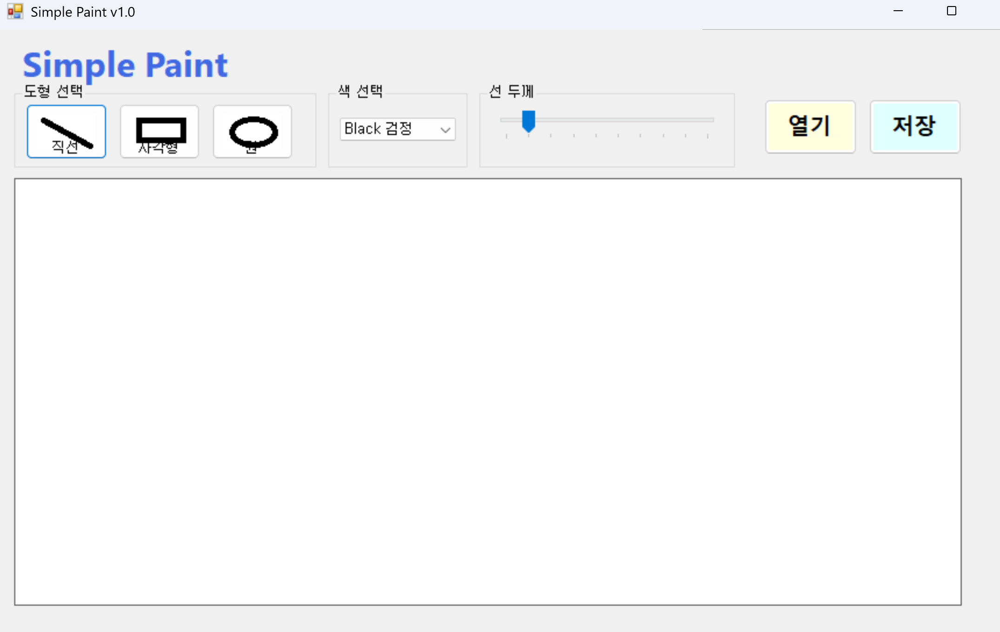
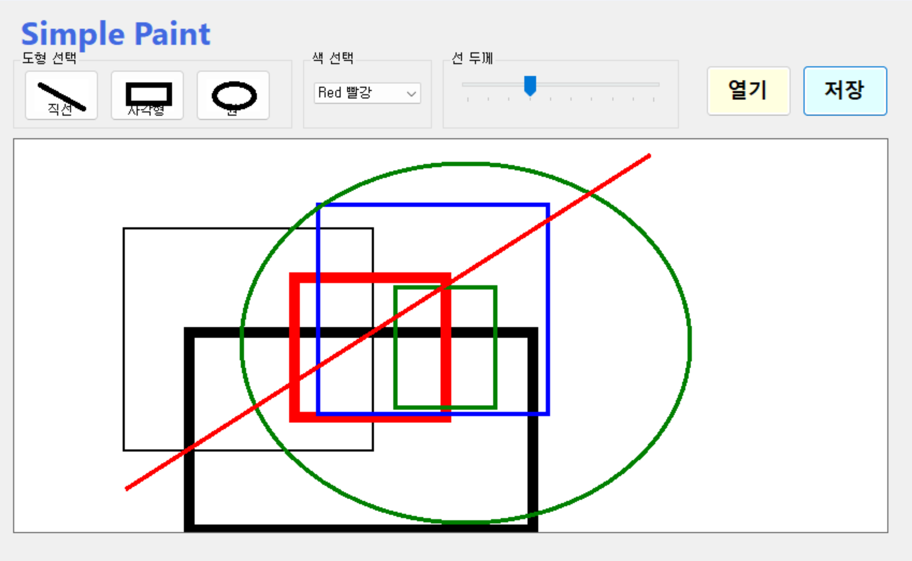

# (C# 코딩) Simple Paint

## 개요
- C# 프로그래밍 학습
- 1줄 소개: 직선, 사각형, 원을 마우스 드래그로 그릴 수 있는 그림판 앱
- 사용한 플랫폼:
  - C#, .NET Windows Forms, Visual Studio, GitHub
- 사용한 컨트롤:
  - Label, GroupBox, Button, ComboBox, TrackBar, PictureBox
- 사용한 기술과 구현한 기능:
  - Visual Studio를 이용하여 UI 디자인
  - Bitmap 클래스를 이용한 캔버스 준비와 Graphics 객체로 도형 그리기
  - Pen 클래스를 이용한 색상과 선 두께 설정
  - 마우스 이벤트(MouseDown/MouseMove/MouseUp)를 이용한 드래그 처리
  - Paint 이벤트와 Invalidate()를 이용한 점선 미리보기 구현
  - enum 타입과 switch 구문을 이용한 도형 종류 분기 처리

## 실행 화면 (과제1)
- 코드의 실행 스크린샷과 구현 내용 설명

- 구현한 내용 (위 그림 참조)
  - UI 구성 : Label(앱 이름 표시), GroupBox 3개(도형 선택 / 색 선택 / 선 두께), Button 5개(직선/사각형/원/열기/저장), ComboBox(색상), TrackBar(선 두께), PictureBox(캔버스)
  - 도형 선택 : 직선(btnLine), 사각형(btnRectangle), 원(btnCircle) 버튼을 클릭하면 currentTool 변수에 ToolType(Line/Rectangle/Circle) 값이 저장되어 어떤 도형을 그릴지 결정
  - 색상 선택 : ComboBox(cmbColor)에 검정/빨강/파랑/녹색 4가지 항목을 등록하고, SelectedIndexChanged 이벤트에서 currentColor에 Color 값을 저장 (기본값: 검정)
  - 선 두께 선택 : TrackBar(trbLineWidth)의 범위를 1~10으로 설정하고, ValueChanged 이벤트에서 currentLineWidth 변수를 갱신
  - 도형 버튼 아이콘 : line.png / square.png / circle.png 이미지를 버튼의 Image 속성에 표시

## 실행 화면 (과제2)
- 코드의 실행 스크린샷과 구현 내용 설명

- 구현한 내용 (위 그림 참조)
  - 캔버스 준비 : PictureBox 크기에 맞춰 Bitmap(canvasBitmap)을 생성하고, Graphics.FromImage()로 그리기용 Graphics(canvasGraphics) 객체를 만든 뒤 흰색으로 초기화
  - 마우스 드래그 처리 :
    - MouseDown : 드래그 시작을 알리고(isDrawing=true) 시작점(startPoint)을 저장
    - MouseMove : 드래그 중에 끝점(endPoint)을 갱신하고 picCanvas.Invalidate()를 호출하여 미리보기를 다시 그리도록 요청
    - MouseUp : 드래그를 종료하고 비트맵에 도형을 확정해서 그리기
  - 미리보기 기능 : Paint 이벤트 핸들러에서 DashStyle.Dash 점선 펜으로 드래그 중인 도형을 화면에 표시
  - 도형 그리기 : DrawShape 함수에서 ToolType에 따라 DrawLine(직선), DrawRectangle(사각형), DrawEllipse(원)을 호출
  - 사각형 좌표 계산 : GetRectangle 함수에서 두 점의 좌표를 받아 Math.Min과 Math.Abs로 좌상단 좌표와 폭/높이를 구해 어느 방향으로 드래그해도 올바른 사각형을 생성
  - 색상과 선 두께 반영 : Pen 객체를 currentColor와 currentLineWidth로 만들어 사용자가 선택한 값으로 그려지도록 처리

## 실행 화면 (과제3)
- 추후 진행 예정

## 실행 화면 (과제4)
- 추후 진행 예정
