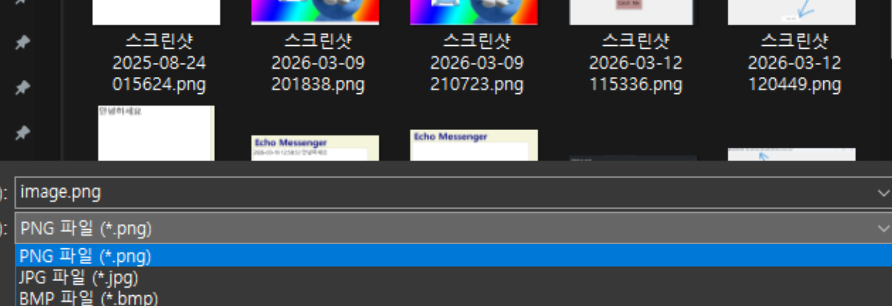
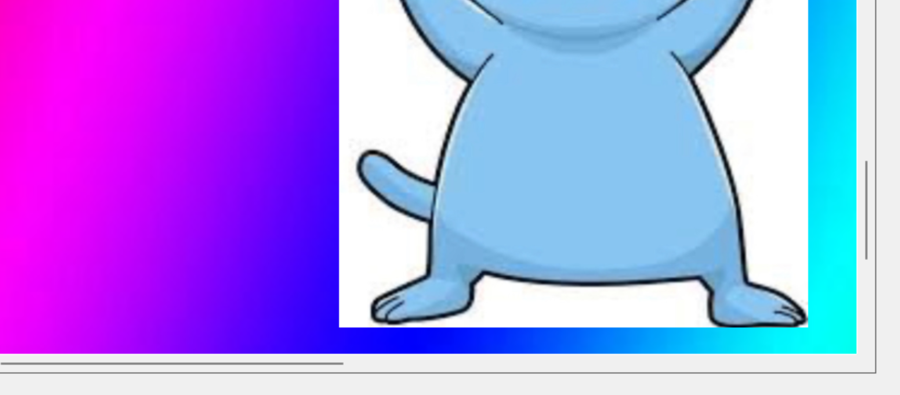

# (C# 코딩) Simple Paint

## 개요
- C# 프로그래밍 학습
- 1줄 소개: 직선, 사각형, 원을 마우스 드래그로 그리고 이미지 파일로 저장하거나 외부 이미지 위에 그림을 그릴 수 있는 그림판 앱
- 사용한 플랫폼:
  - C#, .NET Windows Forms, Visual Studio, GitHub
- 사용한 컨트롤:
  - Label, GroupBox, Button, ComboBox, TrackBar, PictureBox, Panel, OpenFileDialog, SaveFileDialog
- 사용한 기술과 구현한 기능:
  - Visual Studio를 이용하여 UI 디자인
  - Bitmap 클래스를 이용한 캔버스 준비와 Graphics 객체로 도형 그리기
  - Pen 클래스를 이용한 색상과 선 두께 설정
  - 마우스 이벤트(MouseDown/MouseMove/MouseUp)를 이용한 드래그 처리
  - Paint 이벤트와 Invalidate()를 이용한 점선 미리보기 구현
  - enum 타입과 switch 구문을 이용한 도형 종류 분기 처리
  - OpenFileDialog와 SaveFileDialog를 이용한 이미지 파일 입출력
  - ImageFormat을 이용한 PNG / JPG / BMP 다중 포맷 저장
  - Panel.AutoScroll을 이용한 스크롤바 처리와 PictureBox.SizeMode를 이용한 이미지 확대/축소

## 실행 화면 (과제1)
- 코드의 실행 스크린샷과 구현 내용 설명

- 구현한 내용 (위 그림 참조)
  - UI 구성 : Label(앱 이름 표시), GroupBox 3개(도형 선택 / 색 선택 / 선 두께), Button 5개(직선/사각형/원/열기/저장), ComboBox(색상), TrackBar(선 두께), PictureBox(캔버스)
  - 도형 선택 : 직선(btnLine), 사각형(btnRectangle), 원(btnCircle) 버튼을 클릭하면 currentTool 변수에 ToolType(Line/Rectangle/Circle) 값이 저장되어 어떤 도형을 그릴지 결정
  - 색상 선택 : ComboBox(cmbColor)에 검정/빨강/파랑/녹색 4가지 항목을 등록하고, SelectedIndexChanged 이벤트에서 currentColor에 Color 값을 저장 (기본값: 검정)
  - 선 두께 선택 : TrackBar(trbLineWidth)의 범위를 1~10으로 설정하고, ValueChanged 이벤트에서 currentLineWidth 변수를 갱신
  - 도형 버튼 아이콘 : line.png / square.png / circle.png 이미지를 버튼의 Image 속성에 표시

## 실행 화면 (과제2)
- 코드의 실행 스크린샷과 구현 내용 설명

- 구현한 내용 (위 그림 참조)
  - 캔버스 준비 : PictureBox 크기에 맞춰 Bitmap(canvasBitmap)을 생성하고, Graphics.FromImage()로 그리기용 Graphics(canvasGraphics) 객체를 만든 뒤 흰색으로 초기화
  - 마우스 드래그 처리 :
    - MouseDown : 드래그 시작을 알리고(isDrawing=true) 시작점(startPoint)을 저장
    - MouseMove : 드래그 중에 끝점(endPoint)을 갱신하고 picCanvas.Invalidate()를 호출하여 미리보기를 다시 그리도록 요청
    - MouseUp : 드래그를 종료하고 비트맵에 도형을 확정해서 그리기
  - 미리보기 기능 : Paint 이벤트 핸들러에서 DashStyle.Dash 점선 펜으로 드래그 중인 도형을 화면에 표시
  - 도형 그리기 : DrawShape 함수에서 ToolType에 따라 DrawLine(직선), DrawRectangle(사각형), DrawEllipse(원)을 호출
  - 사각형 좌표 계산 : GetRectangle 함수에서 두 점의 좌표를 받아 Math.Min과 Math.Abs로 좌상단 좌표와 폭/높이를 구해 어느 방향으로 드래그해도 올바른 사각형을 생성
  - 색상과 선 두께 반영 : Pen 객체를 currentColor와 currentLineWidth로 만들어 사용자가 선택한 값으로 그려지도록 처리

## 실행 화면 (과제3)
- 코드의 실행 스크린샷과 구현 내용 설명

- 구현한 내용 (위 그림 참조)
  - 이미지 파일 저장 : 저장 버튼(btnSaveFile)을 누르면 SaveFileDialog가 열려서 사용자가 저장 위치와 파일명을 지정할 수 있음
  - 다중 포맷 지원 : 파일 형식 필터로 PNG / JPG / BMP 3가지를 제공
    - "PNG 파일 (*.png)|*.png|JPG 파일 (*.jpg)|*.jpg|BMP 파일 (*.bmp)|*.bmp"
  - 확장자 자동 부가 : SaveFileDialog의 AddExtension 속성을 true로 설정해 사용자가 확장자를 빠뜨려도 자동으로 붙도록 처리
  - 포맷 자동 결정 : Path.GetExtension으로 확장자를 읽고 ToLower로 소문자 변환 후, .jpg/.jpeg는 ImageFormat.Jpeg, .bmp는 ImageFormat.Bmp, 그 외는 ImageFormat.Png로 결정
  - 비트맵 저장 : canvasBitmap.Save(파일경로, ImageFormat) 메서드로 비트맵을 파일로 저장하고, 완료/오류 시 MessageBox로 결과를 사용자에게 안내
  - 예외 처리 : try / catch 구문으로 저장 실패 시 사용자에게 오류 메시지 표시

## 실행 화면 (과제4)
- 코드의 실행 스크린샷과 구현 내용 설명

- 구현한 내용 (위 그림 참조)
  - 외부 이미지 불러오기 : 열기 버튼(btnOpenFile)을 누르면 OpenFileDialog가 열려서 외부 이미지 파일(PNG/JPG/JPEG/BMP)을 선택할 수 있음
  - 캔버스 교체 : Image.FromFile로 읽은 이미지를 new Bitmap(loaded)로 사본을 만들어 원본 파일이 잠기지 않도록 처리하고, 기존 canvasBitmap과 canvasGraphics를 Dispose한 뒤 새 이미지로 교체
  - 캔버스 크기 자동 조정 : 불러온 이미지 크기에 맞게 PictureBox 크기를 조정해서 그 위에 추가로 그림을 그릴 수 있도록 처리
  - 스크롤바 자동 표시 : Designer에서 Panel(pnlCanvas)을 추가하고 picCanvas를 그 안에 배치한 뒤 AutoScroll 속성을 true로 설정해, PictureBox 크기가 Panel보다 커지면 스크롤바가 자동으로 나타남
  - 확대/축소 기능 : zoomFactor 변수로 줌 배율을 관리하고 picCanvas.SizeMode = StretchImage로 설정해 PictureBox 크기에 맞춰 이미지가 늘어나도록 함
    - + 키 : 1.2배 확대 (최대 10배)
    - - 키 : 1.2배 축소 (최소 0.1배)
    - 0 키 : 원본 크기(100%)로 복원
  - 키 입력 처리 : KeyPreview = true로 설정해 폼이 자식 컨트롤보다 키 이벤트를 먼저 받도록 하고, Form1_KeyDown 이벤트에서 + / - / 0 키를 처리
  - 좌표 변환 : ToBitmapPoint 함수로 PictureBox 화면 좌표를 비트맵 원본 좌표로 변환(zoomFactor의 역수 적용)해서 줌 상태에서도 정확한 위치에 도형이 그려지도록 처리
